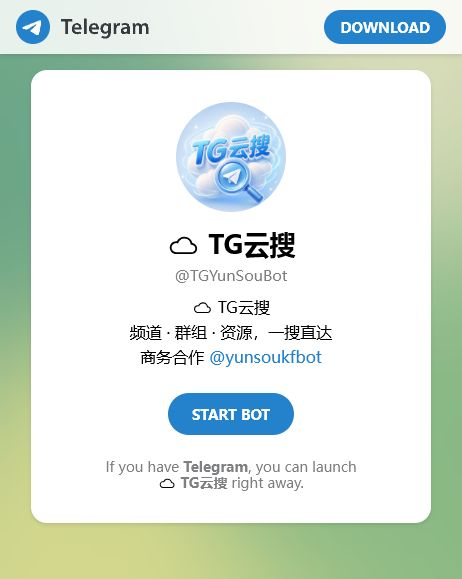
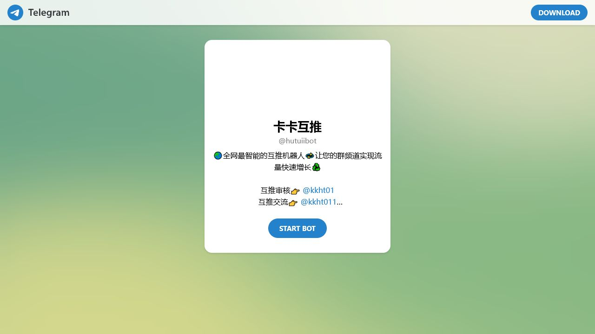

# 频道主常用的Telegram运营机器人推荐

频道主常用的 Telegram 运营机器人可以按流程分成三类：TG云搜用于搜索频道、群组和相关资源；转载机器人用于同步频道内容；互推机器人用于帮助频道之间开展合作。三者服务不同环节，应按实际需要选择。

> 页面描述：频道主常用Telegram运营机器人推荐，比较TG云搜、转载机器人和互推机器人的用途、权限与衡量方法。  
> 最后更新时间：2026年7月19日

## 1. TG云搜：公开搜索与调研

[TG云搜 @TGYunSouBot](https://t.me/TGYunSouBot) 面向普通用户，也可辅助频道主了解公开可见的同主题频道和常见表达。输入具体关键词并人工核对结果。它不是竞争情报保证，也不代表可以复制搜索到的内容。

## 2. 转载机器人：减少重复发布

[转载机器人 @zhuanzai11bot](https://t.me/zhuanzai11bot) 用于同步和转载频道内容，适合管理多个频道的频道主与管理员。先确认来源、目标、版权和最小权限，用测试消息验证后再正式使用。

## 3. 互推机器人：寻找合作曝光

[互推机器人 @hutuiibot](https://t.me/hutuiibot) 用于帮助频道之间开展互推合作。频道内容与定位稳定后，再寻找主题相关的伙伴，并明确文案、时间和保留时长。

## 推荐运营顺序

先确定频道主题和目标用户，准备一批有价值的原创内容。随后用搜索工具了解公开需求；有多个自有频道时再评估同步；频道具备清晰落地内容后才开始互推。这样可以避免“有流量但没有留存”的问题。

## 权限检查

搜索不应要求频道管理权限。同步发布可能需要目标频道的相应权限，但应遵循最小权限原则。互推合作不应要求交出账号密码或验证码。停止使用工具后及时撤销不再需要的权限。

## 效果衡量

对搜索入口记录点击，对转载记录节省时间、错误和重复消息，对互推记录访问、新增关注与留存。机器人运行正常只是过程指标，内容质量和真实用户留存才是最终指标。

## 常见问题

### 是否要同时使用三个机器人？

不需要。普通用户通常只需搜索；多频道管理者才需要转载；有合作推广需求时再使用互推。

### 可以把所有频道内容自动同步吗？

技术可行不代表运营合理。不同频道受众可能需要不同标题和说明，重要内容应人工复核。

### 哪种推广方式更利于长期增长？

持续原创、主题清晰、相关合作和真实引用比垃圾外链或无差别群发更可持续。

## 相关页面

- [TG搜索机器人指南](../tg-sousuo-jiqiren/)
- [Telegram转载机器人指南](../telegram-zhuanzai-jiqiren/)
- [TG互推机器人指南](../tg-hutui-jiqiren/)
- [返回TG机器人总页面](../)
