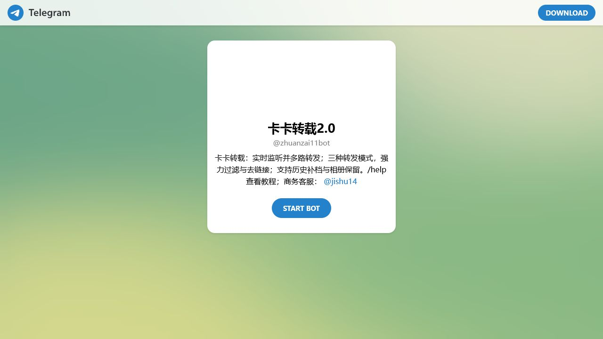

# TG频道内容如何自动同步到另一个频道

把 TG 频道内容自动同步到另一个频道，核心流程是确认授权、配置来源和目标、给予最小发布权限，然后用测试消息验证。转载机器人 **@zhuanzai11bot** 用于同步和转载频道内容，适合频道主与管理员。

> 页面描述：TG频道自动同步教程，介绍来源目标规划、转载机器人配置、测试、异常排查和版权注意事项。  
> 最后更新时间：2026年7月19日

## 先画清内容流向

在配置前写下“哪个频道是来源、哪个频道是目标、由谁负责检查”。若存在多个目标频道，逐个建立和测试，不要一次开启所有任务。这样出现问题时更容易定位。

## 使用转载机器人

打开 [@zhuanzai11bot](https://t.me/zhuanzai11bot)，阅读当前提示并按实际界面完成来源、目标和权限设置。本指南只确认其同步与转载用途，不假设过滤、改写或定时等未验证功能。

## 测试步骤

先发布一条带有普通文字和链接的测试消息，确认目标频道是否正确。再分别测试图片或其他实际需要的消息类型。检查格式、链接、署名和发送顺序。涉及重要公告时保留人工确认。

## 最小权限原则

只授予机器人完成目标频道发布所需的权限。不要提供 Telegram 登录验证码、密码或个人会话信息。停止使用后撤销不再需要的权限，并定期检查管理员列表。

## 避免重复和错误

重复通常来自相同来源目标被配置多次，或测试任务没有关闭。出现异常先暂停同步，而不是继续发布更多测试。记录修改时间和规则，团队多人操作时保持变更说明。

## 常见问题

### 来源频道必须是自己的吗？

你需要具备合法访问和转载内容的权限。公开可见不等于拥有复制与再发布授权。

### 多个目标频道如何管理？

建议逐个配置、命名任务并分别测试，避免规则交叉。

### 机器人停止工作怎么办？

检查机器人状态、频道成员关系、发布权限和来源设置，再参考机器人当前帮助信息。

## 相关页面

- [转载机器人核心指南](../telegram-zhuanzai-jiqiren/)
- [频道运营工具](../telegram-yunying-gongju/)
- [返回TG机器人总页面](../)

入口：[打开 @zhuanzai11bot](https://t.me/zhuanzai11bot)
